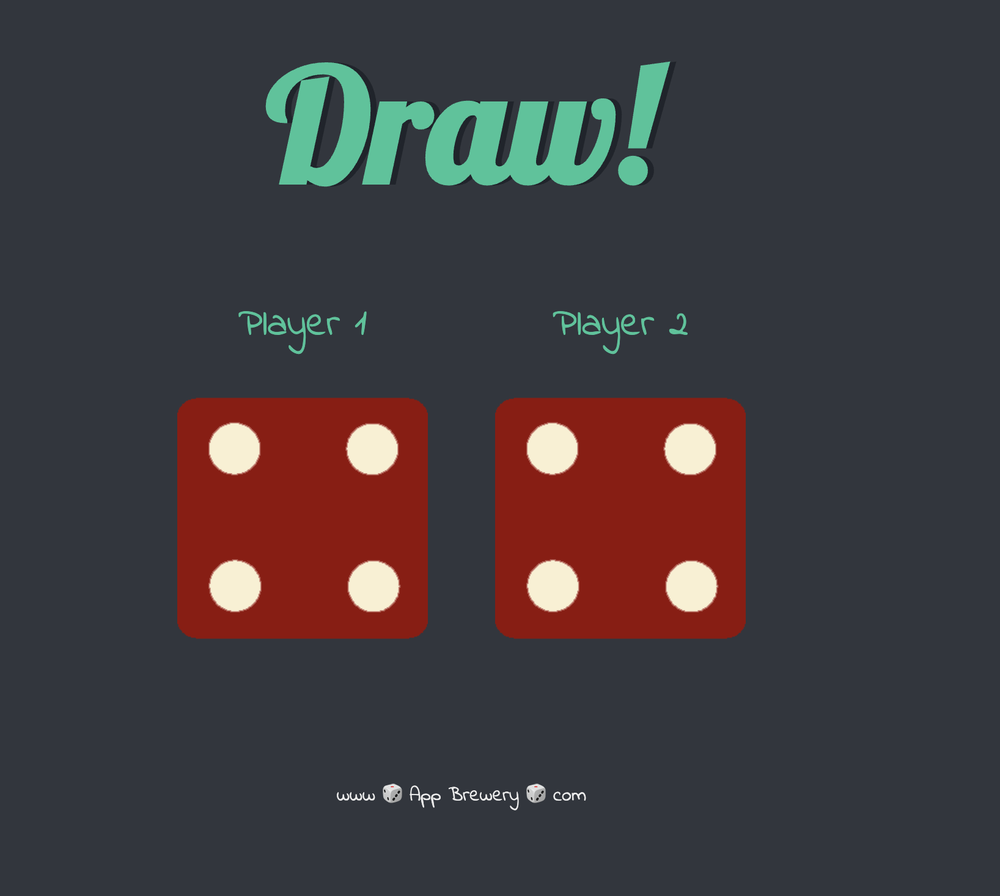

# The Dicee Game

This a working version of the Dicee Game project from the Udemy course [The Complete 2023 Web Development Bootcamp](https://www.udemy.com/course/the-complete-web-development-bootcamp/learn/lecture/12638830?start=30#overview) by Angela Yu of the London App Brewery.

The Dicee Game is Section 17: Boss Level Challenge 1 - The Dicee Game. The project is a simple dice game where the user can refresh the page to roll two dice and the winner is the player with the highest number.

The game itself is fairly dull but it is part of a learning journey.

## Getting Started

1. Clone the repository to your local machine.
2. Run `open dicee.html` from the project directory to open the page in your browser.

## Screenshots

